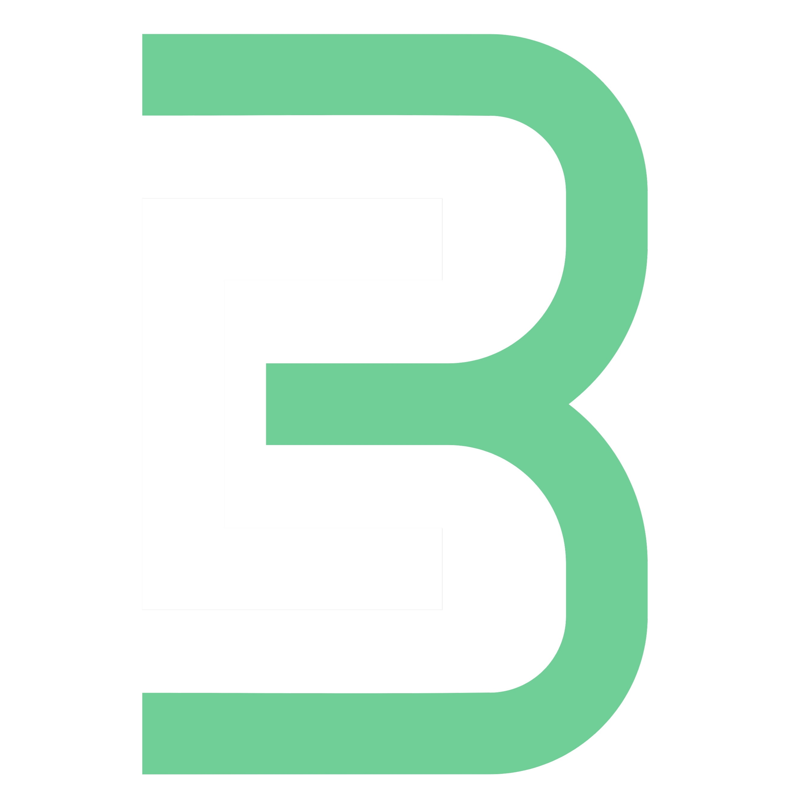

  

<h1 align="center">BuatJalan - PRD & Dev Roadmap Generator</h1>

  <strong>BuatJalan</strong> adalah platform SaaS berbasis kecerdasan buatan (AI) yang dirancang khusus untuk mempermudah developer dan product manager dalam merancang arsitektur aplikasi secara instan. Berikut adalah rincian fitur-fitur lengkap yang telah diimplementasikan dalam proyek ini:

---

## 🌟 Rincian Fitur Platform

### 1. Autentikasi OAuth & Integrasi Sosial (Socialite)
* **Login Multi-Provider**: Memungkinkan pengguna masuk secara aman menggunakan akun Google atau GitHub melalui integrasi Laravel Socialite.
* **Deteksi Integrasi Akun**: Sistem secara dinamis mendeteksi apakah akun pengguna saat ini sudah terhubung ke Google atau GitHub, dan menyajikan opsi untuk menghubungkannya di dalam menu pengaturan jika belum terhubung.

### 2. Manajemen Workspace & Kolaborasi Tim
* **Multi-Workspace**: Pengguna dapat membuat beberapa ruang kerja (Workspace) terpisah untuk mengelola proyek yang berbeda.
* **Workspace Switcher**: Navigasi cepat untuk berpindah workspace secara dinamis dari sidebar tanpa reload halaman.
* **Kolaborasi Tim & Undang Anggota**: Pemilik workspace dapat mengundang anggota tim baru menggunakan email kolaborator.
* **Pembatalan Undangan**: Tersedia dialog konfirmasi kustom bertema gelap untuk membatalkan undangan kolaborasi yang belum diterima oleh penerima.

### 3. AI Project Architect (PRD & Roadmap Generator)
* **Rancangan Spesifikasi AI**: Menghasilkan spesifikasi teknis lengkap yang mencakup Tech Stack, rancangan Database Schema relasional, dan langkah pengerjaan Roadmap secara detail.
* **Product Requirement Document (PRD)**: Mengenerasi PRD berformat Markdown yang komprehensif untuk mendefinisikan ruang lingkup proyek.
* **Modifikasi Proyek Berbasis AI**: Pengguna dapat mengajukan instruksi perubahan (misal: *"Ubah database dari MySQL ke PostgreSQL"* atau *"Tambahkan fitur login multi-role"*) di mana AI akan memproses ulang spesifikasi secara otomatis.
* **Ubah Nama & Deskripsi Proyek**: Pengaturan langsung untuk mengedit judul dan ringkasan proyek melalui modal dialog edit info.

### 4. Sistem Kredit SaaS & Simulasi Pembayaran QRIS (Midtrans)
* **Sistem Saldo Token**: Setiap pembuatan atau pembaruan spesifikasi proyek membutuhkan token kredit yang didebet langsung dari saldo workspace.
* **Checkout Modal Premium**: Dialog pengisian saldo token dengan animasi loading interaktif yang menyimulasikan gerbang pembayaran secure Midtrans.
* **Simulasi Pembayaran QRIS**: Menampilkan gambar kode QRIS fiktif berukuran besar yang memenuhi modal secara responsif.
* **Overlay Centang Sukses "Lunas"**: Ketika transaksi terverifikasi (simulasi), kode QRIS otomatis memudar dan memunculkan animasi centang hijau memantul (*bouncing checkmark*) serta tulisan "Lunas" di atas gambar.
* **Unduh Gambar QRIS**: Tombol frontend yang memungkinkan pengguna untuk langsung mengunduh gambar kode QRIS ke penyimpanan lokal mereka.

### 5. Halaman Analytics & Radar Teknologi
* **Visualisasi Distribusi Teknologi**: Grafik Radar Teknologi yang memetakan persentase sebaran tech stack proyek di workspace saat ini.
* **Keyword Filtering & Auto Splitting**: Menggunakan pencocokan kata kunci pintar untuk menyaring nama teknologi (misal: *"Postgres"* menjadi *"PostgreSQL"*) dan memecah nama komposit (misal: *"Kotlin & MySQL"* dihitung sebagai dua entitas terpisah: "Kotlin" dan "MySQL").
* **Log Aktivitas Scrollable**: Log mutasi kredit dan pembuatan modul AI disajikan dalam bentuk timeline yang dapat digulir (*scrollable*) secara independen dengan batas tinggi maksimal `520px` agar tidak mengganggu tata letak keseluruhan halaman.

### 6. Pengaturan Profil & Visual Settings Modal
* **Edit Profil Instan**: Formulir terisolasi di tab General yang memungkinkan pengguna mengubah nama profil mereka secara langsung tanpa memicu popup *"Save Password"* dari browser.
* **Notifikasi Toast Melayang**: Memunculkan toast sukses beranimasi hijau di pojok kanan bawah setelah berhasil melakukan pembaruan profil yang otomatis menghilang dalam 4 detik.
* **Toggle Dark Mode Interaktif**: Desain sakelar visual (*switch*) premium di sisi frontend yang dapat digeser aktif-nonaktif secara interaktif dengan efek transisi yang sangat mulus.

### 7. Tautan Berbagi Publik & Ekspor Konteks AI (Markdown)
* **Public Shared Link**: Tombol "Salin Tautan Context (Link)" di dashboard menyalin URL publik (`/shared/project/{slug}`) yang dapat diakses oleh siapa saja tanpa perlu login.
* **Halaman Web Publik Premium**: Halaman statis premium khusus untuk menyajikan tech stack, database schema, prd, dan roadmap secara rapi kepada pihak eksternal.
* **AI Raw Context Endpoint**: Menyediakan rute data mentah (`/shared/project/{slug}?format=raw`) dengan respons `Content-Type: text/plain` berisi kode Markdown bersih terstruktur agar mudah dibaca oleh AI coding agent lainnya untuk langsung menghasilkan baris kode.
* **Tombol Copy & Download Lokal**: Tombol sekali-klik di halaman publik untuk langsung menyalin raw Markdown ke clipboard atau mengunduh berkas fisik `.md` secara offline.

### 8. Penanganan Error Kustom Bertema Gelap
* **Custom Error Pages**: Desain kustom elegan dengan efek pendaran cahaya (*glowing backdrop*) dan tombol navigasi kembali ke beranda untuk halaman:
  * **404 (Not Found)**: Efek pendaran hijau/emerald.
  * **403 (Forbidden)**: Efek pendaran kuning/amber.
  * **500 (Internal Server Error)**: Efek pendaran merah.

---

## 🛠️ Tech Stack & Libraries

Proyek ini dibangun menggunakan arsitektur modern berkinerja tinggi dengan kombinasi teknologi berikut:

### Core Framework & Backend
* **Laravel 12**: Framework PHP utama untuk penanganan routing, database relasional, autentikasi, dan middleware keamanan.
* **Livewire v3**: Framework full-stack untuk membuat komponen UI dinamis dan reaktif tanpa menulis Javascript manual yang berlebihan.
* **PHP 8.2+**: Bahasa pemrograman backend utama yang digunakan untuk logika bisnis dan integrasi API.

### Frontend & Styling
* **Tailwind CSS**: Utility-first CSS framework untuk implementasi UI bertema gelap premium secara responsif.
* **Alpine.js**: Library Javascript ringan (bawaan Livewire v3) untuk manajemen state client-side, transisi animasi modal, dan form wizard.
* **Vite**: Bundler aset modern untuk proses kompilasi CSS/JS yang super cepat.

### Integrasi Library & Paket Eksternal
* **Laravel Socialite**: Autentikasi OAuth sosial media (Google & GitHub login/integration).
* **Laravel HTTP Client (Guzzle)**: Penghubung komunikasi API asinkron dengan batas waktu (timeout) 120 detik ke Google Gemini API dan 9router API.
* **Doku/Simulasi**: Logika simulasi pembayaran QRIS menggunakan penanganan status transaksi di frontend.
